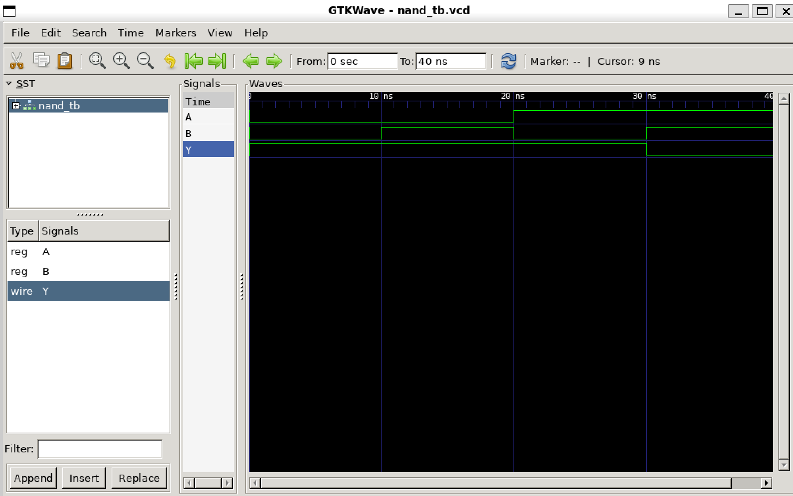

# Explanation of This Directory

## Files

- **nand_gate.v**: Contains the `nand_gate` module. Inclusion guards were added to resolve errors.
- **nand_tb.v**: Testing file for the `nand_gate` module. Dumps information for waveform into `nand_tb.vcd`.
- **nand_test**: File produced by the command `iverilog -o nand_test nand_gate.v nand_tb.v`.
  - Once this file is produced, run the command `vvp nand_test` to execute the simulation, which generates the `.vcd` file.
- **nand_tb.vcd**: Waveform data file produced by the simulation.

## Waveform Image

Here is the waveform image produced when I ran the command `gtkwave nand_tb.vcd`:

